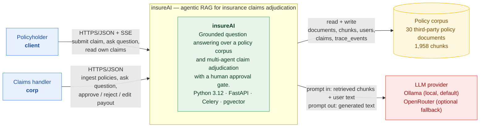
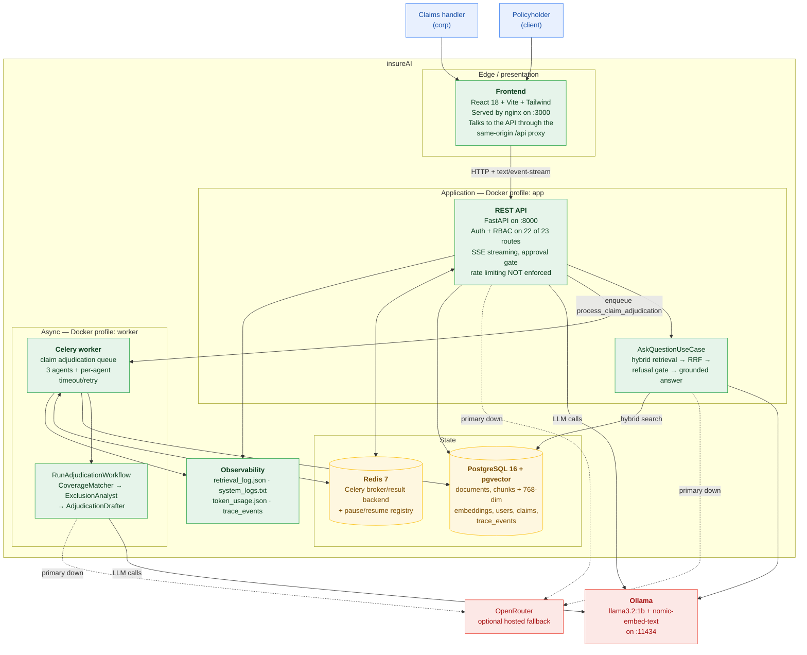
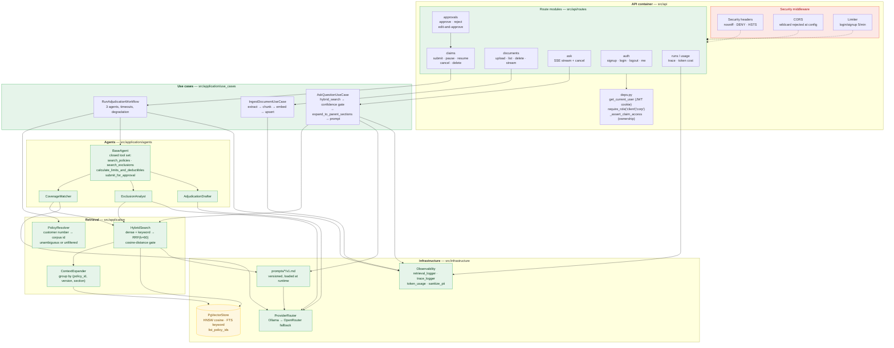
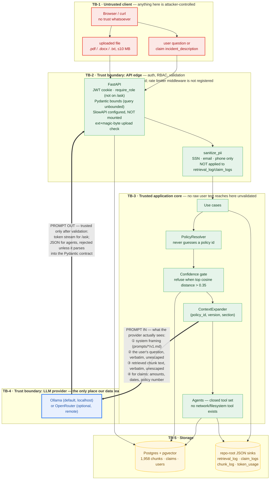
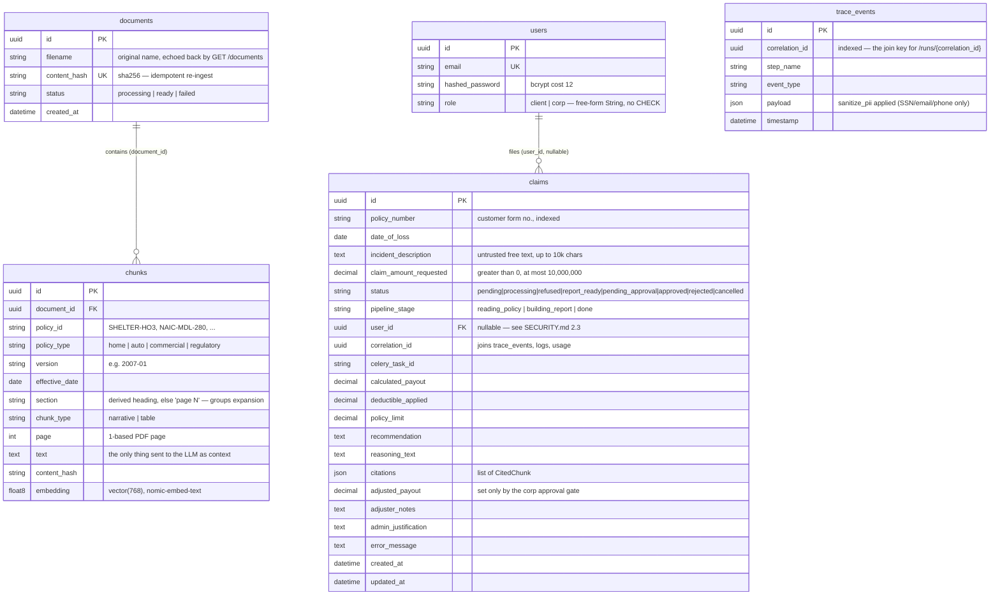
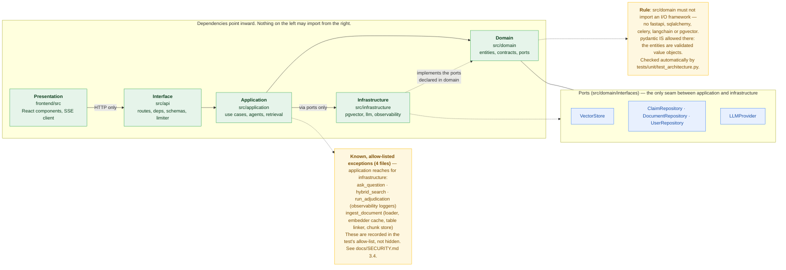

# Architecture

insureAI is an agentic RAG system for insurance claims adjudication. It answers
grounded questions against a corpus of real policy documents, and adjudicates a
submitted claim with three LLM agents whose output a human must approve before
money moves.

- **Diagram source is committed** in [`docs/diagrams/`](diagrams/) as Mermaid
  (`.mmd`) and embedded below so GitHub renders it.
  `tests/unit/test_architecture_docs.py` fails if the two copies drift.
- **Decision records** live in [`docs/adr/`](adr/) — see [ADRs](#adrs).
- **Trust boundaries and what the LLM sees** are in [Data flow](#data-flow-and-trust-boundaries).
  Read that section before changing anything prompt-related.

## Contents

- [C4 Level 1 — System context](#c4-level-1--system-context)
- [C4 Level 2 — Containers](#c4-level-2--containers)
- [C4 Level 3 — Components](#c4-level-3--components)
- [Sequence — agentic claim workflow](#sequence--the-agentic-claim-workflow)
- [Data flow and trust boundaries](#data-flow-and-trust-boundaries)
- [ER diagram](#er-diagram)
- [Layer dependencies](#layer-dependencies)
- [ADRs](#adrs)

---

## C4 Level 1 — System context

Two kinds of user, one system, two dependencies: the policy corpus and the LLM
provider. The system is deliberately *assistive* — it produces a recommendation,
and a human approves it.



**Read this as:** the only outbound trust dependency is the LLM provider. Policy
data and user data both reach it. There is no other network egress.

---

## C4 Level 2 — Containers



| Container | Port | Runs where | Notes |
|---|---|---|---|
| Frontend | `3000` (nginx → `80`) | `docker compose` | Vite dev server also uses `3000`; the proxy keeps cookies same-origin |
| REST API | `8000` | `docker compose`, or `./scripts/dev.sh` | Composition root — wires use cases and ports |
| Celery worker | — | `docker compose --profile worker`, or `./scripts/dev-worker.sh` | Claims only; nothing else is queued |
| PostgreSQL + pgvector | `5432` | `docker compose` | `pgvector/pgvector:pg16`; single database, no replicas |
| Redis | `6379` | `docker compose` | Celery broker **and** the pause/resume registry |
| Ollama | `11434` | `docker compose` | Default LLM + embedder; no API key required |

**Why claims are asynchronous.** Adjudication is three sequential LLM agents, each
with a 180 s timeout and one retry. That is minutes of work, which does not belong
in an HTTP request. The API returns `202` with a `correlation_id` immediately; the
client polls for `status` and `pipeline_stage`, and the worker owns the run.

---

## C4 Level 3 — Components



### The retrieval path, in order

1. `PolicyResolver` maps the customer's policy number to a corpus `policy_id`
   (`HO3-2024-884512 → SHELTER-HO3`). If it cannot resolve unambiguously it
   returns `unresolved` and retrieval runs **unfiltered** — it never guesses.
2. `HybridSearch` runs dense (pgvector HNSW, 40 candidates) and keyword
   (PostgreSQL FTS, 40 candidates) and fuses with RRF, `k=60`.
3. The **refusal gate** refuses when the best dense cosine distance exceeds
   `MAX_COSINE_DISTANCE` (default `0.35`). This replaced an RRF-score floor that
   could never fire, because every non-empty fusion scores at least `1/61`.
4. `ContextExpander` grows each hit to its full section, grouped by
   `(policy_id, version, section)`.
5. The prompt is assembled from a versioned file under `prompts/*/v1.md` — never a
   string literal in application code.

---

> **Read the API box honestly.** `SlowAPI` is imported and a `Limiter` is constructed
> with a `60/minute` default, but `SlowAPIMiddleware` is never registered, so no
> default limit applies to any route. The two routes carrying explicit
> `@limiter.limit` decorators do not fire either. `POST /ask` additionally carries
> **no authentication at all**, despite `docs/API.md` stating that every non-health
> endpoint requires a session. Both are findings, not oversights in the diagram —
> see `docs/SECURITY.md` §2.2 and §6.1.

## Sequence — the agentic claim workflow

The approval gate is the point of the sequence: the drafter *submits* a claim for
approval, and only a `corp` user can move it to `approved`.

```mermaid
%% Sequence — the full agentic claim workflow, with the approval gate and streaming
%% Canonical source. Rendered inline in docs/ARCHITECTURE.md; kept here so the
%% diagram can be linted/exported outside GitHub. tests/unit/test_architecture_docs.py
%% asserts the two copies stay identical.
sequenceDiagram
    autonumber
    actor C as Policyholder (client)
    actor A as Claims handler (corp)
    participant FE as Frontend
    participant API as FastAPI
    participant R as Redis
    participant W as Celery worker
    participant AG as Agents
    participant P as PgVectorStore
    participant L as LLM provider

    rect rgb(232, 240, 254)
    Note over C,API: 1 — Submit (idempotent, async)
    C->>FE: POST /claims {policy_number, date_of_loss,<br/>incident_description, claim_amount_requested, idempotency_key}
    FE->>API: POST /claims (session cookie)
    API->>API: require_role("client")
    API->>P: INSERT claims (status=pending, correlation_id)
    API->>R: enqueue process_claim_adjudication
    API-->>FE: 202 {claim_id, task_id, correlation_id}
    FE-->>C: "submitted — live progress begins"
    end

    rect rgb(255, 247, 224)
    Note over FE,W: 2 — Live progress (SSE poll, not a push stream)
    loop until terminal state
        FE->>API: GET /claims/{id}
        API-->>FE: {status, pipeline_stage}
    end
    opt operator pauses the run
        A->>API: POST /claims/{id}/pause
        API->>R: set pause key
        W->>R: check pause key before each stage
    end
    end

    rect rgb(230, 244, 234)
    Note over W,L: 3 — Adjudication, three agents, each with timeout + 1 retry
    W->>P: load claim + stage=reading_policy
    W->>AG: CoverageMatcher.execute(incident_description)
    AG->>AG: resolve policy number → corpus id<br/>(exact → distinctive segment → unfiltered)
    AG->>P: search_policies(policy_id, query)
    P->>L: embed query
    L-->>P: 768-dim vector
    P->>P: dense HNSW (40) + keyword FTS (40) → RRF(k=60) → top-6
    P-->>AG: ranked chunks with sections
    AG->>L: prompt: <coverage_documents> + question
    L-->>AG: CoverageMatchResult (JSON contract)
    Note right of AG: confidence == no_match → claim.status=refused,<br/>short-circuit. Agent raises → graceful degradation:<br/>fall back to AskQuestionUseCase and deny.

    W->>AG: ExclusionAnalyst.execute(claim + coverage)
    AG->>P: search_exclusions(...) + calculate_limits_and_deductibles(...)
    AG->>L: prompt: <exclusion_documents> + amounts
    L-->>AG: ExclusionAnalysisResult (JSON contract)

    W->>AG: AdjudicationDrafter.execute(everything so far)
    AG->>L: prompt: <adjudication_context> + both results
    L-->>AG: AdjudicationDraft (JSON contract)
    AG->>P: submit_for_approval(draft) → status=pending_approval
    end

    rect rgb(252, 232, 230)
    Note over A,P: 4 — Human approval gate — the LLM cannot approve a claim
    A->>API: GET /approvals
    API-->>A: claims awaiting decision
    A->>API: POST /approvals/{id}/edit-and-approve<br/>{adjusted_payout, justification, notes}
    API->>API: require_role("corp") + status must be pending_approval
    API->>P: status=approved, adjusted_payout, admin_justification
    P-->>C: client re-reads claim → approved + final_payout
    end

    rect rgb(248, 249, 250)
    Note over API,L: 5 — Ask path (grounded Q&A, streamed)
    C->>FE: POST /ask {query}
    FE->>API: POST /ask
    API->>L: embed + generate (streamed tokens)
    L-->>API: text/event-stream: token, metadata, citations
    API-->>FE: SSE frames
    Note right of API: client disconnect cancels the generator;<br/>generation/stream_cancelled is emitted
    end

    rect rgb(242, 242, 242)
    Note over API: 6 — Every retrieval writes one correlated record
    API->>P: retrieval_log.json: dense, keyword, RRF, expansion,<br/>agent steps, final decision
    API->>P: trace_events + token_usage.json
    end
```

### Failure paths worth knowing

| Failure | Behaviour | User sees |
|---|---|---|
| `CoverageMatcher` returns `no_match` | Short-circuit; no further agents | `status=refused` + reason |
| `CoverageMatcher` raises | Graceful degradation: fall back to `AskQuestionUseCase`, deny | `status=report_ready`, `recommendation=deny`, low confidence |
| An agent exceeds 180 s | One retry after 1 s, then give up on that agent | Degraded result, logged |
| The claim's policy number is unknown | Retrieve **unfiltered**, let the LLM decide | Normal adjudication |
| Worker dies mid-run | `claim.error_message` set, status `failed` | `GET /claims/{id}` shows the error |

---

## Data flow and trust boundaries

Five boundaries. The fourth is the one that matters: **the LLM provider is the
only place data leaves the host**, and it receives retrieved text verbatim.



### What the LLM provider receives

For `POST /ask`, the prompt is the concatenation of:

1. the system framing from `prompts/ask_qa/v1.md`;
2. the user's `query`, **verbatim and unescaped**;
3. up to `MAX_CONTEXT_CHARS` (6,000) characters of retrieved chunk text,
   **verbatim and unescaped**;
4. a delimiting instruction that the context is untrusted data, not instructions.

For a claim, the three agents additionally receive the claim amount, date of loss
and policy number. Nothing else — no credentials, no other users' claims, no
document bytes beyond retrieved chunks.

The delimiting instruction is **prompt-level only**. There is no sanitisation of
retrieved text, and an uploaded document is the realistic injection vector. The
mitigation that actually holds is structural: the agent tool set is closed in
`BaseAgent`, so a successful injection still cannot reach the network or the
filesystem. Note the check **fails open** — `base_agent.py:32` skips enforcement
whenever `ALLOWED_TOOLS` is empty, so a subclass that forgets the class variable loses
the control silently. `docs/SECURITY.md` §3.2 has the full analysis and residual risk.

---

## ER diagram

Five tables. Fields and comments are read from `src/infrastructure/db/models.py`.



Notes that a diagram cannot show:

- `claims.citations` and `claims.reasoning_text` are `NULL` until the pipeline
  finishes; a `report_ready` claim always has both.
- `trace_events` is written but never read back for authorization. It is an audit
  trail, not an access-control source.
- There is **no** approvals table. The approval decision is denormalised onto
  `claims` (`status`, `adjusted_payout`, `admin_justification`).

---

## Layer dependencies



`src/api` importing use cases and ports is **not** a violation — the API is the
composition root, and wiring dependencies is its job.

The rule and the four allow-listed exceptions are both asserted by
`tests/unit/test_architecture.py`, so neither can grow unnoticed.

---

## ADRs

Six decision records, in [`docs/adr/`](adr/). Each states context, decision, and
consequences — including the consequences that turned out badly.

| ADR | Decision | Why it still holds |
|---|---|---|
| [000](adr/000-architecture-and-langchain-boundary.md) | Clean Architecture with LangChain confined to infrastructure | Keeps the domain testable without a network or a model |
| [001](adr/001-provider-abstraction-fallback.md) | `LLMProvider` port, Ollama primary, OpenRouter fallback | The system runs with no API key at all |
| [002](adr/002-prompt-injection-defense.md) | Delimit context, instruct the model to treat it as data, refuse when unsupported | Still the only *runtime* defence; the closed tool set is what actually holds |
| [003](adr/003-chunking-strategy.md) | Section-aware chunking with policy metadata | Sections are what make parent expansion and citations meaningful |
| [004](adr/004-vector-store-choice.md) | pgvector in Postgres, no dedicated vector DB | One backup, one transaction, one place to look |
| [005](adr/005-orchestration-pattern.md) | Supervised linear pipeline, not a free-form agent graph | Auditable and replayable; the approval gate needs a known order |

Two of these have been revised by experience, and the ADRs say so:

- **002** assumed instruction-level defences were sufficient. They are not the
  real control; see `docs/SECURITY.md` §3.
- **003** assumed a `Title` ancestor would always be present in extracted
  documents. The installed `langchain_unstructured` emits
  `category="CompositeElement"` with `parent_id=None`, so 1,956 of 1,958 chunks
  had an empty `section` and expansion silently did nothing. Sections are now
  derived from the chunk text (`src/infrastructure/ingestion/section_titles.py`),
  with `scripts/backfill_chunk_sections.py` to repair existing rows.
